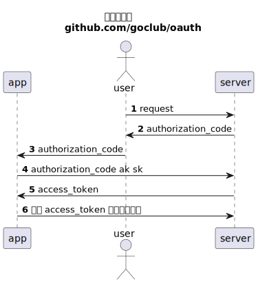
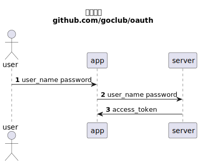

# oauth

> 建议有调用方过 oauth 授权服务的经验下阅读，例如做过微信公众号/小程序开发。

例如在微信公众号/小程序的场景下，开发人员可以通过微信实现的 [oauth](https://developers.weixin.qq.com/doc/offiaccount/OA_Web_Apps/Wechat_webpage_authorization.html)
获取 access token,再基于 access token 获取用户的微信信息。

一般互联网大公司的用户体系都会提供 oauth。我们作为普通用户遇到的：微信授权登录，微博授权，qq授权，支付宝授权。都是oauth的一种应用场景。

> 可以将 oauth 理解为用户Z 授权应用A 访问 应用B 中用户Z 数据的一种实现约定。

## 术语

- 资源服务器：保存用户数据的服务
- 资源拥有者：用户
- 授权服务器：生成 access token 的服务
- 应用：通过授权服务器获取到 access token 后向资源服务访问用户数据

---

- 客户凭证：账号密码
- 令牌：授权服务器生成的 access token
- 作用域：令牌的权限范围(以 github 为例：低权限作用域只能获取用户信息，高权限作用域能修改用户仓库中的代码)

---

- 授权码：authorization code 客户应用引导用户进入授权服务器，授权服务器返回授权码
- 访问令牌：access token 通过授权码向资源服务器换取访问令牌
- 刷新令牌: refresh token 访问令牌会有过期时间，可以通过刷新令牌获取新的访问令牌
-

## authorization code 授权码模式

在

第1/2步必须让用户跳转到 server， server 确保用户在登录状态下同意授权信息给app。

第4步中需要附带 ak sk 防止恶意攻击方获取到 authorization_code 后非法获取用户数据。

> 适合 app 是第三方应用的场景，例如微信公众号/小程序

## implicit 隐藏模式

安全性低，因为省略了 authorization_code 环节， access token 可能会泄露

> 适合 app 和 server 属于同一个公司的场景

# password 密码模式

最不安全的模式，用户的密码被 app 知道了。

> 不推荐使用

# client credentials 凭证模式

适合服务器对服务器，没有普通用户这个角色。

例如一些云服务的API有 ak sk  就是一种凭证模式。

> 适合云服务的API
